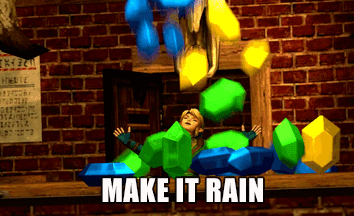

# Rupee Royale 

Welcome to Rupee Royale! The goal of this Zelda-themed game is to replicate the score that is shown to the user at the start of the game, under "Match this Score:". 

### When the Game Starts
Using Math.random(), a random number between 19 and 120 will be chosen, and displayed in the "Match this Score" section. 
Additionally, Math.random() will pick a random number between 1 and 12 to be associated with each of the 4 rupees. 

### Determining the values of the Rupees
By clicking on the different colored rupees, the user will be able to see how much their score is incremented, indicating the associated point value tied to each different-colored rupee. Using this information, they can click the various rupees to reach the score that they need to match. 

### When the Game Ends 
The game will end when the user either matches the score or goes above the score to be matched. 

Try Rupee Royale! Match the score, and a surprise will be waiting for you! ;)

